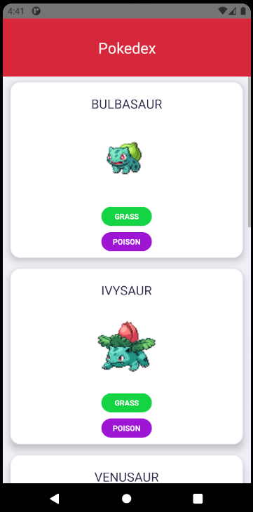
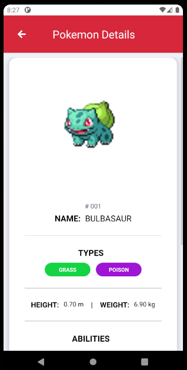

## Pokedex

Simples app de Pokedex (catálogo de Pokemóns) que consome dados da api do [pokeapi.co](pokeapi.co/) para exibir uma lista de Pokemóns e alguns de seus detalhes. 

  

Foi utilizado o framework [React Native](https://reactnative.dev) o desenvolvimento do app.

### Dependências

Para buildar a aplicação, basta ter o [*npm*](https://www.npmjs.com/) e o [*node*](https://nodejs.org/en/) instalados e rodar `npm install` (para versões 7+ do npm, talvez seja necessário rodar `npm install --legacy-peer-deps`).

### Build & Run

Para rodar em um emulador Android ou num dispositivo conectado via adb em modo debug, por exemplo, basta possuir o ambiente configurado para tal (emulador instalado, Android SDK, adb, etc.), e conectar o dispositivo ou abrir o emulador. 
Para verificar se o dispositivo está conectado via adb, basta `adb devices`. O identificador do dispositivo deve ser listado no output do comando.

Para rodar a aplicação, basta rodar `npm start` (o que é equivalente a rodar `react-native start`).
Isso irá rodar um server do Metro Bundler localmente.

Com o server rodando, abra uma outra sessão do terminal e rode o comando `npm run android` (que é o equivalente a rodar `react-native run-android`) para rodar o app no dispositivo conectado.

### Considerações

Considerei utilizar um manejador de estados com o Redux, porém devido à baixa complexidade do app, decidi não utilizar enquanto.
